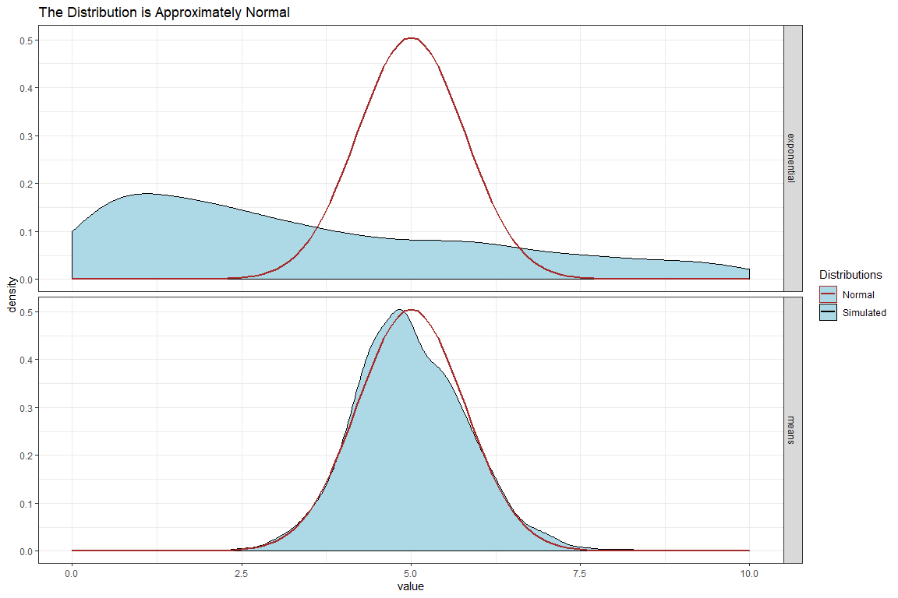

```r
knitr::opts_chunk$set(echo = TRUE,
                      fig.width = 12,
                      fig.height = 8,
                      warning = FALSE,
                      message = FALSE)
Sys.setlocale("LC_ALL","English")
pacman::p_load(tidyverse, knitr)
```

## Synopsis
The Central Limit Theorem (or CLT for short) is one of the crucial aspects of probability theory and a powerful tool for inferential data analysis. The application of CLT requires only a few assumpttions and the resulted inference is robust to the population's distribution. In this document we will demonstrate the CLT application on the example of exponentialy distributed data.

## Introduction
In short, the CLT's statement can be expressed as the following equation:
$$\frac{\overline{X_{n}} - \mu}{\sigma / \sqrt{n}}$$
Which basically means that the averages ($\overline{X_{n}}$) of independent and identically distributed random variables are approximately normaly distributed with the mean close to the population mean and the variance close to $\sigma^2 / n$, if samples are large enough.

In this case $\sigma$ represents standard deviation of the population and n is the sample size.
Even though the researcher typicaly doesn't know the process that generates the population variable (and hence the population's standard deviation - $\sigma$), it is known that the replacement of the standard error ($\sigma / \sqrt{n}$) by its estimated value does not change the CLT.

## The Simulation
To demonstrate this point we would use exponential distribution (which is very different from normal distribution) with parameter $\lambda = 0.2$. We would generate 40 random exponential values, take their mean and repeat this process 1000 times to generate a distribution of averages.


```r
nsim = 1000
n = 40
lambda = .2
set.seed(9)
# data.frame of the original exponentials and the means of exponentials:
g <- tibble(exponential = rexp(nsim, lambda),
            means = apply(matrix(rexp(nsim * n, lambda), n), 2, mean)) %>%
        gather(factor_key = TRUE)
```

### 1. The sample mean vs the theoretical mean
The theoretical mean of the exponential distribution is equal to $\frac{1}{\lambda}$.
The comparison shows that the simulation is not far enough from the theory:


```r
# theoretical mean:
t_m = 1 / lambda

# sample mean:
s_m = mean(g$value[g$key == "means"])

# the difference:
d_m = abs(t_m - s_m)

# table for comparison:
tibble(`theoretical mean` = t_m,
       `sample mean` = s_m,
       `absolute difference` = d_m)
```

```
## # A tibble: 1 x 3
##   `theoretical mean` `sample mean` `absolute difference`
##                <dbl>         <dbl>                 <dbl>
## 1                  5          5.00               0.00368
```

### 2. The sample variance vs the theoretical variance
The theoretical standard deviation of the exponential distribution is also $\frac{1}{\lambda}$.
However, since we took *averages* of those values, what we need now is the standard error of estimate $\sigma / \sqrt{n}$. And because variance is standard deviation squared, our theoretical variance shoud be:
$$var = (\sigma / \sqrt{n})^2 = (\frac{1}{\lambda} / \sqrt{n})^2 = \frac{1}{\lambda^2 n}$$


```r
# theoretical variance:
t_v = 1 / (lambda^2 * n)

# sample variance:
s_v = var(g$value[g$key == "means"])

# the difference:
d_v = abs(t_v - s_v)

# table for comparison:
tibble(`theoretical variance` = t_v,
       `sample variance` = s_v,
       `absolute difference` = d_v)
```

```
## # A tibble: 1 x 3
##   `theoretical variance` `sample variance` `absolute difference`
##                    <dbl>             <dbl>                 <dbl>
## 1                  0.625             0.681                0.0555
```
And again we see results that are close to the expected values. But that's not all! With CLT not only can we get the good estimates of the mean and the standard deviation / variance of the sample means, but we can also get the entire distribution. To illustrate this point (and how the resulted distribution of means is different from the original distribution) we can draw a density plot, containing the simulated exponential distribution (upper plot, black line filled with blue) and the distribution of simulated means (bottom plot, black line filled with blue) overlayed by the normal distribution (brown line):

### 3. The distribution is approximately normal


```r
# ploting:
ggplot(g)+
        facet_grid(rows = vars(key))+
        geom_density(aes(x = value, color = "Simulated"),
                     fill = "lightblue")+
        stat_function(fun = dnorm,
                      args = list(mean = t_m, sd = sqrt(t_v)), aes(color = "Normal"), size = 1)+
        scale_colour_manual("Distributions",
                            values = c("brown", "black"))+
        ggtitle("The Distribution is Approximately Normal")+
        theme_bw()+
        xlim(0, 10)
```

<!-- -->
From this plot it is obvious that even though the initial distribution was far from "gaussian", the distribution of its means looks more like a normal distribution.


#
