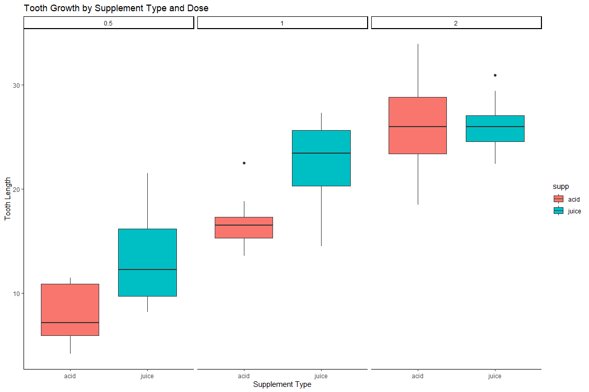

```r
knitr::opts_chunk$set(echo = TRUE,
                      fig.width = 12,
                      fig.height = 8,
                      warning = FALSE,
                      message = FALSE)
Sys.setlocale("LC_ALL","English")
options(scipen = 10)
pacman::p_load(tidyverse, knitr)
```

## Synopsis
The goal of this project is to explore the effect of vitamin C supplementation on tooth growth in guinea pigs with control for the dose and the delivery method of the vitamin. The analysis is based on the dataset of 60 guinea pigs and providing the underlying assumptions to be the case the conclusions can be extended to the general population of guinea pigs.

## 1-2. Loading the data and basic EDA:

```r
tdf <-
        ToothGrowth %>%
        as_tibble %>%
        mutate(supp = recode_factor(supp, VC = "acid", OJ = "juice"))

summary(tdf)
```

```
##       len           supp         dose      
##  Min.   : 4.20   acid :30   Min.   :0.500  
##  1st Qu.:13.07   juice:30   1st Qu.:0.500  
##  Median :19.25              Median :1.000  
##  Mean   :18.81              Mean   :1.167  
##  3rd Qu.:25.27              3rd Qu.:2.000  
##  Max.   :33.90              Max.   :2.000
```
It might be a good idea to visualize our dataset:

```r
ggplot(tdf, aes(x = supp, y = len, fill = supp))+
        facet_grid(cols = vars(dose))+
        geom_boxplot()+
        labs(title = "Tooth Growth by Supplement Type and Dose",
             x = "Supplement Type",
             y = "Tooth Length")+
        theme_classic()
```

<!-- -->
The overall picture shows us that there seems to be a an increase in tooth growth when the dosage increases, but the effect of substitution of the way of vitamin administration is not so simple.
If we do not control for the supplement type it would seem that there is no significant difference between doses of 1mg and 2mg. However, if do the otherwise (like on the previous plot), we can notice that growth of teeth continues in the group of those guinea pigs that received their vitamin C in the form of "acid" (ascorbic acid) if we shift from 1mg to 2mg.

## 3. Comparing tooth growth by supp and dose.
In this section we will compare the tooth growth in groups of guinea pigs using inferential techniques, i.e. we will try to spread our conclusions on the general population. Because the dataset contains information on several groups of guinea pigs it would be better to use ANOVA. Unfortunately, we are prohibited to use any methods that were not covered during the course, thus we will be limited to t-tests only.

## Assumptions:
First, we will assume that **the groups of guinea pigs are independent**. It is a reasonable assumption since in the description of the dataset we can find that a single animal recieved only 1 type of supplement and in only 1 dose. In this case we will also assume that in the population the **length of teeth is a normally distributed** property and that the **variances in the groups are not equal**. And finally, we will assume that the test subjects were **selected at random** (i.e. every guinea pig had equal opportunity to be included in the sample). All comparisons are done at the 0.95 confidence level.

## On multiple comparisons...
By comparing each pair of groups individually, we are forced to use the same data several times. This could lead us to increased chances of making a type I error, a false discovery. To avoid such thing from happening, after pairwise comparisons we are going to adjust p-values using Boferroni's correction. Thus, the overall procedure will be to:

1. loop over all levels of dose factor and compare tooth length in pairs of supplement types (orange juice vs ascorbic acid) with t-tests for independent groups.
2. obtain corresponding p-values.
3. adjust p-values from the previous step to produce a final decision.
4. for each type of supplement loop over all levels of dose and make the same comparison as in the first step.
5. obtain corresponding p-values.
6. adjust p-values from the previous step to produce a final decision.

### Ascorbic acid vs Orange Juice.

```r
doses <- unique(tdf$dose)
supps <- unique(tdf$supp)
# all posible pairs of doses:
dcomb <- combn(doses, 2, simplify = FALSE)

# creating a named list for p-values:
supp_test <-
        vector("list", length(doses)) %>%
        set_names(paste0("s", doses))

# pairwise comparison of supp levels:
for (i in seq(doses)) {
        supp_test[[paste0("s", doses[i])]] <- 
                tdf %>%
                filter(dose == doses[i]) %>%
                t.test(len ~ supp, data = .) %>%
                .[["p.value"]]
}

# p-values adjustment:
p.adjust(supp_test, "bonferroni")
```

```
##        s0.5          s1          s2 
## 0.019075820 0.003115128 1.000000000
```
We can conclude that the orange juice is better at tooth growth in doses 0.5 mg and 1 mg, but there is no statistically significant difference among supplement types for dose of 2 mg of vitamin C.

### Doses of vitamin C.

```r
# creating a named list for p-values:
dose_test <-
        vector("list", length(dcomb) * length(supps)) %>%
        set_names(paste(rep(supps, each = 3), dcomb))

# pairwise comparison of doses for each supp level:
for (i in seq(supps)) {
        for (j in seq(dcomb)) {
                dose_test[[sprintf("%s c(%s, %s)",
                                   supps[i],
                                   dcomb[[j]][1],
                                   dcomb[[j]][2])]] <- 
                        tdf %>%
                        filter(supp == supps[i],
                               dose %in% dcomb[[j]]) %>%
                        t.test(len ~ dose, data = .) %>%
                        .[["p.value"]]
        }
}

# p-values adjustment:
p.adjust(dose_test, "bonferroni")
```

```
##  acid c(0.5, 1)  acid c(0.5, 2)    acid c(1, 2) juice c(0.5, 1) juice c(0.5, 2) 
## 0.0000040866106 0.0000002808946 0.0005493361834 0.0005270951433 0.0000079427033 
##   juice c(1, 2) 
## 0.2351708522775
```
For both types of supplement there seems to be a statistically significant increase in tooth growth of guinea pigs when we compare each type of doses pairwise. The only exception is the orange juice that does not make much difference when the dose increased from 1 mg of vitamin to 2 mg.

Reference for the dataset:
C. I. Bliss (1952). The Statistics of Bioassay. Academic Press.
